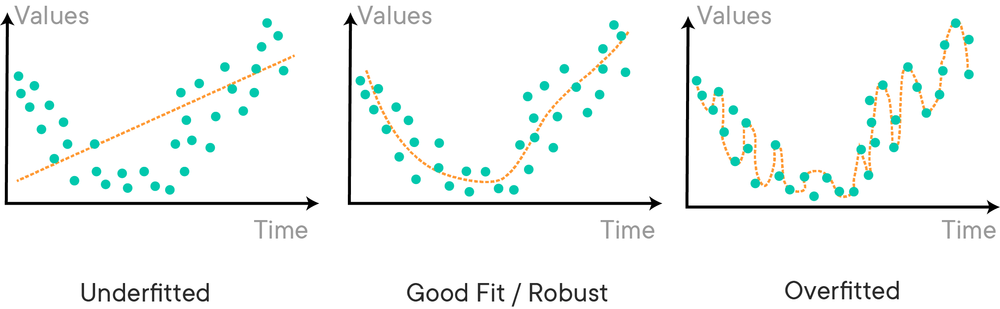

# Regression Model Validation

## Introduction

Previously you've briefly touched upon model evaluation when using a multiple linear regression model for prediction. In this lesson you'll learn why it's important to split your data in a train and a test set if you want to do proper performance evaluation.

## Objectives

You will:
* Compare training and testing errors to determine if model is over or underfitting

## The need for train-test split

### Making predictions and evaluation

So far we've simply been fitting models to data, and evaluated our models calculating the errors between our $\hat y$ and our actual targets $y$, while these targets $y$ contributed in fitting the model.

The reason why we built the model in the first place, however, is because we want to predict the outcome for observations that are not necessarily in our dataset now; e.g: we want to predict miles per gallon for a new car that isn't part of our dataset, or for a new house in Boston.

In order to get a good sense of how well your model will be doing on new instances, you'll have to perform a so-called "train-test-split". What you'll be doing here, is take a sample of the data that serves as input to "train" our model - fit a linear regression and compute the parameter estimates for our variables, and calculate how well our predictive performance is doing comparing the actual targets $y$ and the fitted $\hat y$ obtained by our model.

### Underfitting and overfitting

Another reason to use train-test-split is because of a common problem which doesn't only affect linear models, but nearly all (other) machine learning algorithms: overfitting and underfitting. An overfit model is not generalizable and will not hold to future cases. An underfit model does not make full use of the information available and produces weaker predictions than is feasible. The following image gives a nice, more general demonstration:



### Mechanics of train-test split
When performing a train-test-split, it is important that the data is **randomly** split. At some point, you will encounter datasets that have certain characteristics that are only present in certain segments of the data. For example, if you were looking at sales data for a website, you might expect the data to look different on days that promotional deals were held versus days that deals were not held. If we don't randomly split the data, there is a chance we might overfit to the characteristics of certain segments of data.

Another thing to consider is just how big each training and testing set should be. There is no hard and fast rule for deciding the correct size, but the range of training set is usually anywhere from 66% - 80% (and testing set between 33% and 20%). Some types of machine learning models need a substantial amount of data to train on, and as such, the training sets should be larger. Some models with many different tuning parameters will need to be validated with larger sets (the test size should be larger) to determine what the optimal parameters should be. When in doubt, just stick with training set sizes around 70% and test set sizes around 30%.

## How to evaluate?

It is pretty straightforward that, to evaluate the model, you'll want to compare your predicted values, $\hat y$ with the actual value, $y$. The difference between the two values is referred to as the residuals. When using a train-test split, you'll compare your residuals for both test set and training set:

$r_{i,train} = y_{i,train} - \hat y_{i,train}$ 

$r_{i,test} = y_{i,test} - \hat y_{i,test}$ 

To get a summarized measure over all the instances in the test set and training set, a popular metric is the (Root) Mean Squared Error:

RMSE = $\sqrt{\frac{1}{n}\sum_{i=1}^{n}(y_{i} - \hat y_{i})^2}$

MSE = $\frac{1}{n}\sum_{i=1}^{n}(y_{i} - \hat y_{i})^2$

Again, you can compute these for both the traing and the test set. A big difference in value between the test and training set (R)MSE is an indication of overfitting.

## Applying this to our auto-mpg data

Let's copy our pre-processed auto-mpg data again


```python
import pandas as pd
import numpy as np
from sklearn.model_selection import train_test_split
from sklearn.preprocessing import MinMaxScaler, StandardScaler, FunctionTransformer, OneHotEncoder

data = pd.read_csv('auto-mpg.csv')

y = data[['mpg']]
X = data.drop(['mpg', 'car name'], axis=1)
```

Scikit-learn has a very useful function, `train_test_split()`. The optional argument `test_size` makes it possible to choose the size of the test set and the training set. Since the observations are randomly assigned to the training and test splits each time you run `train_test_split()`, you can also pass an optional `random_state` argument to obtain reproducible results. This will ensure your training and test sets are always the same.  


```python
X_train, X_test, y_train, y_test = train_test_split(X, y, test_size=0.2, random_state=42)
print(len(X_train), len(X_test), len(y_train), len(y_test))
```

    313 79 313 79


Once you have split the data, you can now apply transformations on the training set using scikit-learn transformers, and then use these transformers on the test set. 


```python
# Instantiate a StandardScaler
standard_scaler = StandardScaler()

# Instantiate a MinMaxScaler
min_max_scaler = MinMaxScaler()

# Instantiate a custom transformer for log transformation 
log_transformer = FunctionTransformer(np.log, validate=True)
```


```python
# Columns to be log transformed 
log_columns = ['displacement', 'horsepower', 'weight'] 

# Log transform the training columns and convert them into a DataFrame 
X_log_train = pd.DataFrame(log_transformer.fit_transform(X_train[log_columns]), 
                           columns=['log_disp', 'log_hp', 'log_wt'])

# Log transform the test columns and convert them into a DataFrame 
X_log_test = pd.DataFrame(log_transformer.transform(X_test[log_columns]), 
                          columns=['log_disp', 'log_hp', 'log_wt'])
```


```python
# Concat the log transform columns - training set
X_train_combined = pd.concat([X_train.reset_index(drop=True), X_log_train], axis=1)
X_train_combined.head()
```


<div>
<style scoped>
    .dataframe tbody tr th:only-of-type {
        vertical-align: middle;
    }

    .dataframe tbody tr th {
        vertical-align: top;
    }

    .dataframe thead th {
        text-align: right;
    }
</style>
<table border="1" class="dataframe">
  <thead>
    <tr style="text-align: right;">
      <th></th>
      <th>cylinders</th>
      <th>displacement</th>
      <th>horsepower</th>
      <th>weight</th>
      <th>acceleration</th>
      <th>model year</th>
      <th>origin</th>
      <th>log_disp</th>
      <th>log_hp</th>
      <th>log_wt</th>
    </tr>
  </thead>
  <tbody>
    <tr>
      <th>0</th>
      <td>6</td>
      <td>225.0</td>
      <td>110</td>
      <td>3620</td>
      <td>18.7</td>
      <td>78</td>
      <td>1</td>
      <td>5.416100</td>
      <td>4.700480</td>
      <td>8.194229</td>
    </tr>
    <tr>
      <th>1</th>
      <td>4</td>
      <td>140.0</td>
      <td>92</td>
      <td>2572</td>
      <td>14.9</td>
      <td>76</td>
      <td>1</td>
      <td>4.941642</td>
      <td>4.521789</td>
      <td>7.852439</td>
    </tr>
    <tr>
      <th>2</th>
      <td>6</td>
      <td>171.0</td>
      <td>97</td>
      <td>2984</td>
      <td>14.5</td>
      <td>75</td>
      <td>1</td>
      <td>5.141664</td>
      <td>4.574711</td>
      <td>8.001020</td>
    </tr>
    <tr>
      <th>3</th>
      <td>8</td>
      <td>318.0</td>
      <td>150</td>
      <td>4135</td>
      <td>13.5</td>
      <td>72</td>
      <td>1</td>
      <td>5.762051</td>
      <td>5.010635</td>
      <td>8.327243</td>
    </tr>
    <tr>
      <th>4</th>
      <td>4</td>
      <td>86.0</td>
      <td>64</td>
      <td>1875</td>
      <td>16.4</td>
      <td>81</td>
      <td>1</td>
      <td>4.454347</td>
      <td>4.158883</td>
      <td>7.536364</td>
    </tr>
  </tbody>
</table>
</div>


```python
# Concat the log transform columns - test set
X_test_combined = pd.concat([X_test.reset_index(drop=True), X_log_test], axis=1)
X_test_combined.head()
```


<div>
<style scoped>
    .dataframe tbody tr th:only-of-type {
        vertical-align: middle;
    }

    .dataframe tbody tr th {
        vertical-align: top;
    }

    .dataframe thead th {
        text-align: right;
    }
</style>
<table border="1" class="dataframe">
  <thead>
    <tr style="text-align: right;">
      <th></th>
      <th>cylinders</th>
      <th>displacement</th>
      <th>horsepower</th>
      <th>weight</th>
      <th>acceleration</th>
      <th>model year</th>
      <th>origin</th>
      <th>log_disp</th>
      <th>log_hp</th>
      <th>log_wt</th>
    </tr>
  </thead>
  <tbody>
    <tr>
      <th>0</th>
      <td>4</td>
      <td>96.0</td>
      <td>69</td>
      <td>2189</td>
      <td>18.0</td>
      <td>72</td>
      <td>2</td>
      <td>4.564348</td>
      <td>4.234107</td>
      <td>7.691200</td>
    </tr>
    <tr>
      <th>1</th>
      <td>4</td>
      <td>121.0</td>
      <td>115</td>
      <td>2795</td>
      <td>15.7</td>
      <td>78</td>
      <td>2</td>
      <td>4.795791</td>
      <td>4.744932</td>
      <td>7.935587</td>
    </tr>
    <tr>
      <th>2</th>
      <td>4</td>
      <td>91.0</td>
      <td>60</td>
      <td>1800</td>
      <td>16.4</td>
      <td>78</td>
      <td>3</td>
      <td>4.510860</td>
      <td>4.094345</td>
      <td>7.495542</td>
    </tr>
    <tr>
      <th>3</th>
      <td>4</td>
      <td>91.0</td>
      <td>70</td>
      <td>1955</td>
      <td>20.5</td>
      <td>71</td>
      <td>1</td>
      <td>4.510860</td>
      <td>4.248495</td>
      <td>7.578145</td>
    </tr>
    <tr>
      <th>4</th>
      <td>4</td>
      <td>140.0</td>
      <td>86</td>
      <td>2790</td>
      <td>15.6</td>
      <td>82</td>
      <td>1</td>
      <td>4.941642</td>
      <td>4.454347</td>
      <td>7.933797</td>
    </tr>
  </tbody>
</table>
</div>


```python
# Apply StandardScaler to training columns
scaled_train_1 = pd.DataFrame(standard_scaler.fit_transform(X_train_combined[['log_disp', 'log_wt']]), 
                              columns=['scaled_disp', 'scaled_wt'])

# Apply StandardScaler to test columns
scaled_test_1 = pd.DataFrame(standard_scaler.transform(X_test_combined[['log_disp', 'log_wt']]), 
                             columns=['scaled_disp', 'scaled_wt'])
```


```python
# Apply MinMaxScaler to training columns
scaled_train_2 = pd.DataFrame(min_max_scaler.fit_transform(X_train_combined[['log_hp', 'acceleration']]), 
                              columns=['scaled_hp', 'scaled_acc'])

# Apply MinMaxScaler to test columns
scaled_test_2 = pd.DataFrame(min_max_scaler.transform(X_test_combined[['log_hp', 'acceleration']]), 
                             columns=['scaled_hp', 'scaled_acc'])
```


```python
# Categorical columns
X_train_cat = X_train_combined[['cylinders', 'model year', 'origin']]
X_test_cat = X_test_combined[['cylinders', 'model year', 'origin']]

# Instantiate OneHotEncoder
ohe = OneHotEncoder(handle_unknown='ignore')

# Transform training and test sets
X_train_ohe = ohe.fit_transform(X_train_cat)
X_test_ohe = ohe.transform(X_test_cat)

# Get all categorical feature names
cat_columns = ohe.get_feature_names(input_features=X_train_cat.columns)

# Fit and transform the training data
X_train_categorical = pd.DataFrame(X_train_ohe.todense(), columns=cat_columns)

# Transform test data
X_test_categorical = pd.DataFrame(X_test_ohe.todense(), columns=cat_columns)
```


```python
# Combine continuous and categorical feature DataFrames
X_train_processed = pd.concat([scaled_train_1, scaled_train_2, X_train_categorical], axis=1)
X_test_processed = pd.concat([scaled_test_1, scaled_test_2, X_test_categorical], axis=1)
```

Great, now that you have preprocessed all the columns, you can fit a linear regression model: 


```python
from sklearn.linear_model import LinearRegression
linreg = LinearRegression()
linreg.fit(X_train_processed, y_train)

y_hat_train = linreg.predict(X_train_processed)
y_hat_test = linreg.predict(X_test_processed)
```

Look at the residuals and calculate the MSE for training and test sets:  


```python
train_residuals = y_hat_train - y_train
test_residuals = y_hat_test - y_test
```


```python
mse_train = np.sum((y_train - y_hat_train)**2)/len(y_train)
mse_test = np.sum((y_test - y_hat_test)**2)/len(y_test)
print('Train Mean Squarred Error:', mse_train)
print('Test Mean Squarred Error:', mse_test)
```

    Train Mean Squarred Error: mpg    6.68959
    dtype: float64
    Test Mean Squarred Error: mpg    5.896757
    dtype: float64


You can also do this directly using sklearn's `mean_squared_error()` function: 


```python
from sklearn.metrics import mean_squared_error

train_mse = mean_squared_error(y_train, y_hat_train)
test_mse = mean_squared_error(y_test, y_hat_test)
print('Train Mean Squarred Error:', train_mse)
print('Test Mean Squarred Error:', test_mse)
```

    Train Mean Squarred Error: 6.689589737676632
    Test Mean Squarred Error: 5.896756666574742


Great, there does not seem to be a big difference between the train and test MSE! Interestingly, the test set error is smaller than the training set error. This is fairly rare but does occasionally happen.

## Additional resources

Great job! You now have a lot of ingredients to build a pretty good (multiple) linear regression model. We'll add one more concept in the next lesson: the idea of cross-validation. But first, we strongly recommend you have a look at [this blogpost](https://towardsdatascience.com/linear-regression-in-python-9a1f5f000606) to get a refresher on a lot of the concepts learned!

## Summary 

In this lesson, you learned the importance of the train-test split approach and were introduced to one of the most popular metrics for evaluating regression models, (R)MSE. You also saw how to use the `train_test_split()` function from `sklearn` to split your data into training and test sets. 
